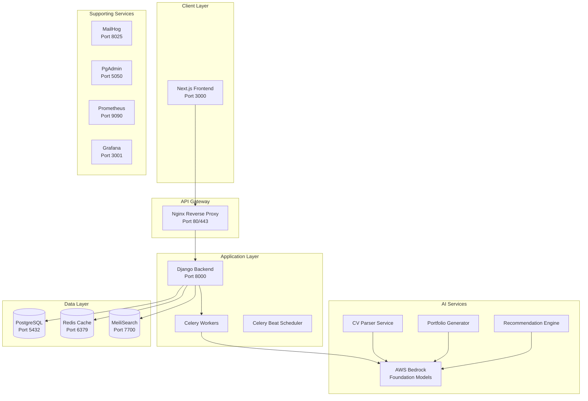
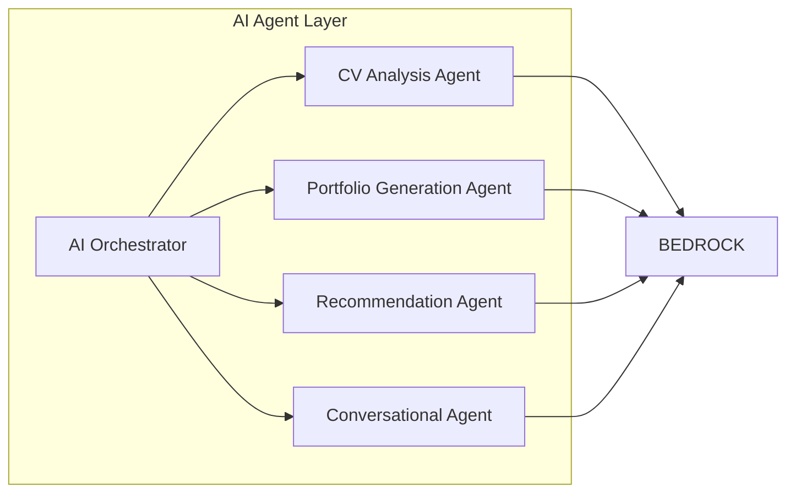
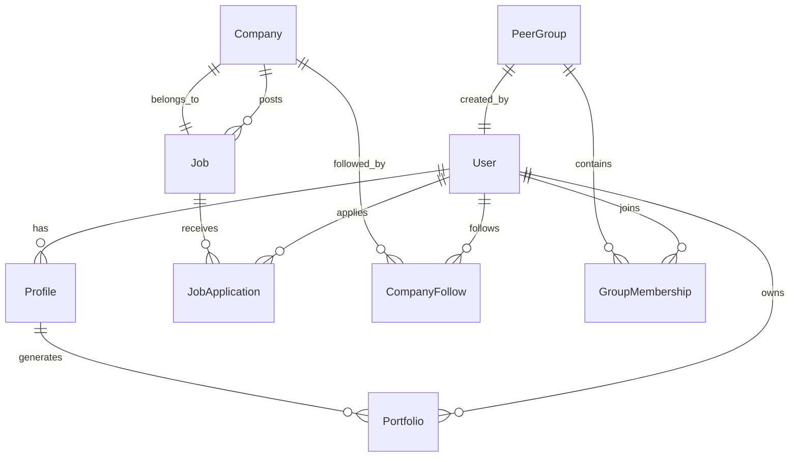

# Koroh Platform Design Document

## Overview

Koroh is a comprehensive AI-powered professional networking platform built as a monorepo with a React/Next.js frontend and Django backend. The platform leverages AWS Bedrock for intelligent features including CV analysis, portfolio generation, job recommendations, and peer matching. The entire system is containerized using Docker with supporting services for scalability and monitoring.

## Architecture

### High-Level Architecture



### Container Architecture

The platform uses Docker Compose to orchestrate multiple services:

- **Frontend Container**: Next.js application with React
- **Backend Container**: Django REST API with Python dependencies
- **Database Container**: PostgreSQL with persistent volumes
- **Cache Container**: Redis for session management and caching
- **Search Container**: MeiliSearch for full-text search capabilities
- **Task Queue**: Celery workers and beat scheduler
- **Monitoring Stack**: Prometheus and Grafana for metrics
- **Development Tools**: MailHog for email testing, PgAdmin for database management

## Components and Interfaces

### Frontend Components (Next.js/React)

#### Core Pages

- **Landing Page**: XING-inspired design with job search, company discovery, networking sections
- **Dashboard**: Personalized user dashboard with AI recommendations
- **Profile Management**: CV upload, portfolio customization, profile editing
- **Job Search**: AI-powered job discovery with filtering and recommendations
- **Company Tracker**: Follow companies, view insights, track opportunities
- **Peer Groups**: Discover, join, and manage professional peer groups
- **Portfolio Viewer**: Display generated professional portfolios

#### Shared Components

- **Navigation**: Responsive header with authentication and main navigation
- **AI Chat Interface**: Interactive chat for AI-powered assistance
- **File Upload**: Drag-and-drop CV upload with progress indicators
- **Recommendation Cards**: Reusable cards for jobs, companies, and peer groups
- **Notification System**: Toast notifications and in-app alerts

### Backend Components (Django)

#### Core Applications

- **Authentication**: User registration, login, JWT token management
- **Profiles**: User profile management, CV storage, portfolio settings
- **AI Services**: Integration with AWS Bedrock for various AI tasks
- **Jobs**: Job posting management, search, and recommendation engine
- **Companies**: Company profiles, tracking, and insights
- **Groups**: Peer group creation, membership, and communication
- **Notifications**: Email and in-app notification system

#### API Endpoints Structure

```
/api/v1/
├── auth/
│   ├── register/
│   ├── login/
│   ├── refresh/
│   └── logout/
├── profiles/
│   ├── me/
│   ├── upload-cv/
│   ├── generate-portfolio/
│   └── portfolios/
├── jobs/
│   ├── search/
│   ├── recommendations/
│   └── applications/
├── companies/
│   ├── search/
│   ├── follow/
│   └── insights/
├── groups/
│   ├── discover/
│   ├── join/
│   └── messages/
└── ai/
    ├── chat/
    ├── analyze-cv/
    └── generate-content/
```

### AI Service Integration

#### AWS Bedrock Integration

- **Foundation Models**: Claude, Titan, Jurassic for different AI tasks
- **CV Analysis**: Extract skills, experience, education from uploaded documents
- **Content Generation**: Create portfolio content, job descriptions, recommendations
- **Semantic Search**: Understand user intent for job and company matching
- **Conversation AI**: Provide intelligent chat assistance

#### AI Agent Architecture



## Data Models

### Core Models

#### User Model

```python
class User(AbstractUser):
    email = EmailField(unique=True)
    first_name = CharField(max_length=150)
    last_name = CharField(max_length=150)
    profile_picture = ImageField(upload_to='profiles/')
    is_verified = BooleanField(default=False)
    created_at = DateTimeField(auto_now_add=True)
    updated_at = DateTimeField(auto_now=True)
```

#### Profile Model

```python
class Profile(Model):
    user = OneToOneField(User, on_delete=CASCADE)
    headline = CharField(max_length=200)
    summary = TextField()
    location = CharField(max_length=100)
    industry = CharField(max_length=100)
    experience_level = CharField(max_length=50)
    skills = JSONField(default=list)
    cv_file = FileField(upload_to='cvs/')
    portfolio_url = URLField(blank=True)
    preferences = JSONField(default=dict)
```

#### Job Model

```python
class Job(Model):
    title = CharField(max_length=200)
    company = ForeignKey('Company', on_delete=CASCADE)
    description = TextField()
    requirements = JSONField(default=list)
    location = CharField(max_length=100)
    salary_range = CharField(max_length=100)
    job_type = CharField(max_length=50)
    posted_date = DateTimeField(auto_now_add=True)
    is_active = BooleanField(default=True)
```

#### Company Model

```python
class Company(Model):
    name = CharField(max_length=200)
    description = TextField()
    industry = CharField(max_length=100)
    size = CharField(max_length=50)
    location = CharField(max_length=100)
    website = URLField()
    logo = ImageField(upload_to='companies/')
    followers = ManyToManyField(User, through='CompanyFollow')
```

#### PeerGroup Model

```python
class PeerGroup(Model):
    name = CharField(max_length=200)
    description = TextField()
    industry = CharField(max_length=100)
    experience_level = CharField(max_length=50)
    is_private = BooleanField(default=False)
    created_by = ForeignKey(User, on_delete=CASCADE)
    members = ManyToManyField(User, through='GroupMembership')
    created_at = DateTimeField(auto_now_add=True)
```

### Database Relationships



## Error Handling

### Frontend Error Handling

- **Global Error Boundary**: Catch and display React component errors
- **API Error Interceptors**: Handle HTTP errors with user-friendly messages
- **Form Validation**: Real-time validation with clear error messages
- **Network Error Recovery**: Retry mechanisms for failed requests
- **Loading States**: Proper loading indicators for async operations

### Backend Error Handling

- **Custom Exception Classes**: Structured error responses with error codes
- **Middleware Error Handling**: Global exception handling with logging
- **Validation Errors**: Detailed field-level validation error responses
- **AI Service Errors**: Graceful handling of AWS Bedrock service failures
- **Rate Limiting**: Prevent abuse with proper error responses

### Error Response Format

```json
{
  "error": {
    "code": "VALIDATION_ERROR",
    "message": "Invalid input data",
    "details": {
      "field_name": ["This field is required"]
    },
    "timestamp": "2024-01-01T00:00:00Z"
  }
}
```

## Testing Strategy

### Frontend Testing

- **Unit Tests**: Jest and React Testing Library for components
- **Integration Tests**: Test API integration and user workflows
- **E2E Tests**: Playwright for critical user journeys
- **Visual Regression**: Screenshot testing for UI consistency
- **Accessibility Tests**: Automated a11y testing with axe-core

### Backend Testing

- **Unit Tests**: Django TestCase for models, views, and utilities
- **API Tests**: Django REST Framework test client for endpoint testing
- **Integration Tests**: Test AI service integration with mocked responses
- **Performance Tests**: Load testing for critical endpoints
- **Security Tests**: Authentication, authorization, and input validation

### AI Service Testing

- **Mock Testing**: Test AI workflows with mocked Bedrock responses
- **Contract Testing**: Verify AI service integration contracts
- **Performance Testing**: Monitor AI service response times
- **Quality Testing**: Validate AI output quality and accuracy

### Infrastructure Testing

- **Container Tests**: Verify Docker container builds and configurations
- **Service Integration**: Test inter-service communication
- **Database Migration Tests**: Ensure schema changes work correctly
- **Monitoring Tests**: Verify metrics collection and alerting

## Security Considerations

### Authentication & Authorization

- **JWT Tokens**: Secure token-based authentication
- **Role-Based Access**: Different permission levels for users
- **API Rate Limiting**: Prevent abuse and ensure fair usage
- **CORS Configuration**: Proper cross-origin resource sharing setup

### Data Protection

- **Input Validation**: Sanitize all user inputs
- **SQL Injection Prevention**: Use Django ORM parameterized queries
- **File Upload Security**: Validate file types and scan for malware
- **Data Encryption**: Encrypt sensitive data at rest and in transit

### AWS Security

- **IAM Roles**: Least privilege access for AWS services
- **VPC Configuration**: Secure network isolation
- **Secrets Management**: Use AWS Secrets Manager for sensitive data
- **Audit Logging**: Comprehensive logging for security monitoring

## Performance Optimization

### Frontend Optimization

- **Code Splitting**: Lazy load components and routes
- **Image Optimization**: Next.js automatic image optimization
- **Caching Strategy**: Browser caching and CDN integration
- **Bundle Analysis**: Monitor and optimize bundle sizes

### Backend Optimization

- **Database Indexing**: Optimize queries with proper indexes
- **Caching Layer**: Redis for session and data caching
- **Connection Pooling**: Efficient database connection management
- **Async Processing**: Celery for background tasks

### AI Service Optimization

- **Response Caching**: Cache AI responses for similar requests
- **Batch Processing**: Process multiple requests efficiently
- **Model Selection**: Choose appropriate models for different tasks
- **Timeout Handling**: Proper timeout configuration for AI calls

## Deployment Strategy

### Development Environment

- **Docker Compose**: Local development with all services
- **Hot Reloading**: Fast development iteration
- **Debug Tools**: Comprehensive debugging and profiling
- **Test Data**: Seed data for development and testing

### Production Deployment

- **Container Orchestration**: Kubernetes or ECS for production
- **Load Balancing**: Distribute traffic across multiple instances
- **Auto Scaling**: Scale based on demand and metrics
- **Blue-Green Deployment**: Zero-downtime deployments

### Monitoring & Observability

- **Metrics Collection**: Prometheus for system and application metrics
- **Visualization**: Grafana dashboards for monitoring
- **Log Aggregation**: Centralized logging with structured logs
- **Alerting**: Automated alerts for critical issues
